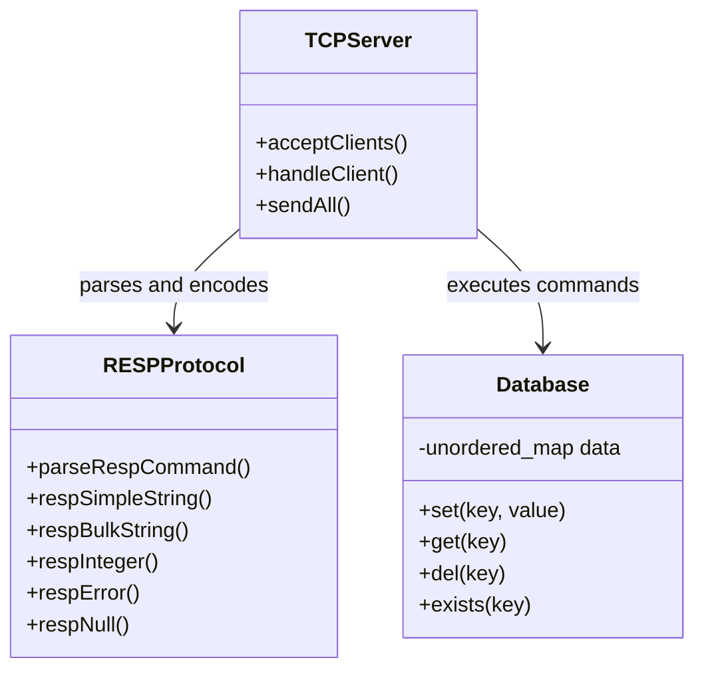

# FlashKV

FlashKV is a lightweight, Redis-compatible, in-memory key-value database built from scratch in C++.

The project explores database internals, TCP networking, persistent client connections, command parsing, and the Redis Serialization Protocol (RESP2).

## Features

- In-memory key-value storage
- Approximately O(1) average lookup using `std::unordered_map`
- TCP server running on port `6379`
- Persistent client connections
- RESP2 request parsing and response encoding
- Compatible with `redis-cli`
- Handles partial and multiple TCP messages
- Supports multiple-key `DEL` and `EXISTS`
- Built with C++20, CMake, and Ninja

## Supported Commands

| Command | Description | Example |
|---|---|---|
| `PING` | Check whether the server is running | `PING` |
| `ECHO` | Return the supplied message | `ECHO "Hello"` |
| `SET` | Store a value | `SET name Dhyan` |
| `GET` | Retrieve a value | `GET name` |
| `DEL` | Delete one or more keys | `DEL name city` |
| `EXISTS` | Count existing keys | `EXISTS name city` |

## Architecture

FlashKV follows a simple client-server architecture:

1. A client connects through TCP.
2. The server receives data and stores incomplete messages in a buffer.
3. The RESP parser converts the request into command arguments.
4. The command handler executes the requested operation.
5. The database reads or modifies its in-memory hash map.
6. The result is encoded as a RESP response and returned to the client.

## UML Diagram



## Project Structure

```text
FlashKV/
├── include/
│   ├── database.hpp
│   └── resp.hpp
├── src/
│   ├── main.cpp
│   ├── database.cpp
│   ├── resp.cpp
│   └── tcp_server.cpp
├── tests/
├── .gitignore
├── CMakeLists.txt
└── README.md
```

## Requirements

- C++20-compatible compiler
- CMake 3.20 or newer
- Ninja
- Redis CLI for compatibility testing

## Environment Setup

Create and activate an isolated Conda environment:

```bash
conda create --name emberkv -c conda-forge \
    python=3.12 cmake ninja compilers

conda activate emberkv
```

Install `redis-cli` inside the environment:

```bash
conda install -c conda-forge redis-server
```

## Build

From the project root:

```bash
cmake -S . -B build -G Ninja
cmake --build build
```

The build creates two executables:

```text
build/flashkv
build/flashkv_server
```

## Run the Local CLI

```bash
./build/flashkv
```

Example:

```text
flashkv> SET name Dhyan
OK
flashkv> GET name
Dhyan
flashkv> EXISTS name
1
flashkv> DEL name
1
flashkv> GET name
(nil)
```

## Run the TCP Server

Start FlashKV:

```bash
./build/flashkv_server
```

Expected output:

```text
FlashKV listening on 127.0.0.1:6379
```

The server listens only on the local machine.

## Connect Using Redis CLI

Open another terminal:

```bash
conda activate emberkv
redis-cli -h 127.0.0.1 -p 6379
```

Example:

```text
127.0.0.1:6379> PING
PONG

127.0.0.1:6379> SET name Dhyan
OK

127.0.0.1:6379> GET name
"Dhyan"

127.0.0.1:6379> EXISTS name
(integer) 1

127.0.0.1:6379> DEL name
(integer) 1

127.0.0.1:6379> GET name
(nil)
```

## Test RESP Directly

A raw RESP request can also be sent using Netcat:

```bash
printf '*1\r\n$4\r\nPING\r\n' |
nc 127.0.0.1 6379
```

Expected raw response:

```text
+PONG
```

## Current Limitations

- Only string values are supported.
- Data is lost when the server stops.
- Clients are handled one at a time.
- Key expiration is not implemented yet.
- Authentication and encryption are not supported.
- Replication and clustering are not supported.

## Roadmap
- [x] In-memory key-value storage
- [x] Basic commands
- [x] TCP server
- [x] Persistent TCP connections
- [x] RESP2 parsing and encoding
- [x] `redis-cli` compatibility
- [x] `EXPIRE` and `TTL`
- [ ] Active expiration cleanup
- [x] Append-only file persistence
- [x] Poll-based event loop
- [x] Concurrent client handling
- [ ] Fully non-blocking socket I/O
- [ ] Memory limits and LRU eviction
- [ ] Automated tests
- [ ] Performance benchmarks
- [ ] Additional Redis data types

## Learning Goals

FlashKV is designed to explore:

- How in-memory databases store data
- How TCP servers accept and process connections
- Why TCP applications require input buffering
- How application-level protocols are designed
- How Redis clients and servers communicate using RESP
- How expiration, persistence, and eviction systems work
- How event loops support many simultaneous clients

## Status

FlashKV is currently an educational Redis-compatible database under active development.