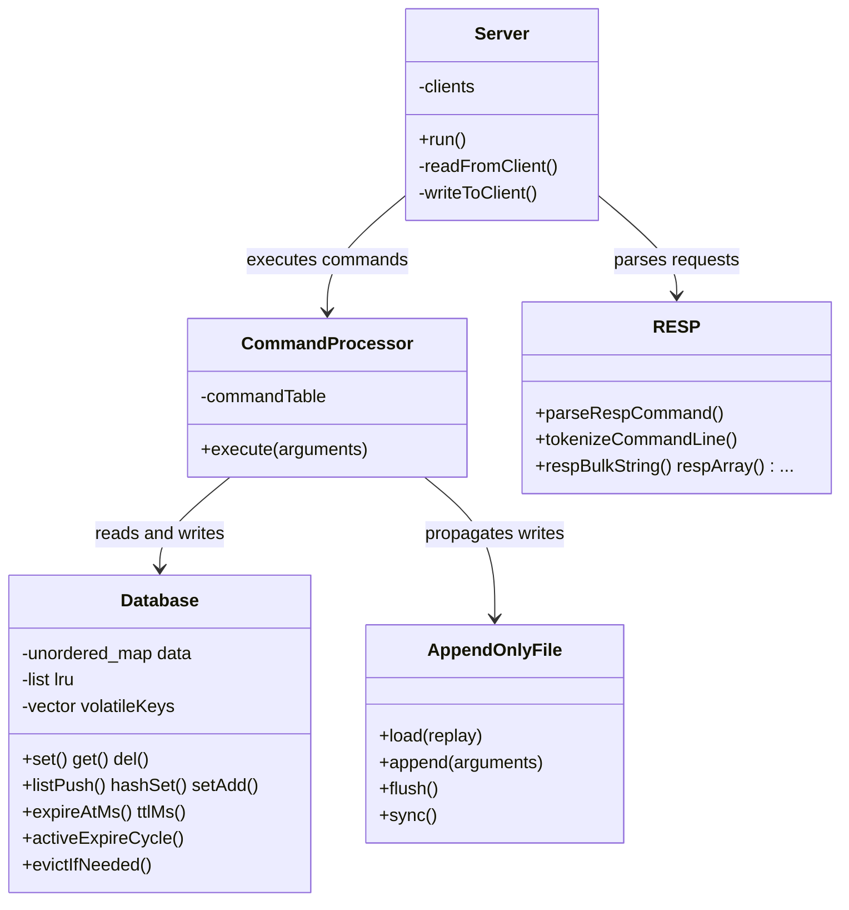

# FlashKV

**[▶ Live demo](https://dhyanagni2001-commits.github.io/FlashKV/)**: try the real engine in your browser, compiled to WebAssembly.

FlashKV is a lightweight, Redis-compatible, in-memory key-value database built from scratch in C++20.

The project explores database internals, non-blocking TCP networking, the Redis Serialization Protocol (RESP2), expiration, persistence and memory eviction. It works with `redis-cli` and other Redis clients, and the same engine also compiles to WebAssembly for an in-browser playground.

## Features

- Strings, lists, hashes and sets with Redis semantics (including `WRONGTYPE` errors)
- 53 Redis commands, compatible with `redis-cli`
- Single-threaded `poll()` event loop with fully non-blocking sockets
- Per-client input/output buffers, pipelining and backpressure
- RESP2 parsing (binary-safe, incremental) plus inline commands for `nc`/telnet
- Key expiration: lazy on access plus a Redis-style active expiration cycle
- `maxmemory` limit with O(1) LRU eviction (`allkeys-lru`) or `noeviction`
- Append-only file (AOF) persistence with absolute expiry timestamps, fsync every second and truncated-tail repair
- Graceful shutdown on `SIGINT`/`SIGTERM`
- Unit tests, end-to-end integration tests, sanitizer builds and CI
- Built-in benchmark tool
- WebAssembly playground running the real engine in the browser
- Docker image

## Supported Commands

| Group | Commands |
|---|---|
| Strings | `SET` (with `EX`, `PX`, `NX`, `XX`), `GET`, `MSET`, `MGET`, `INCR`, `DECR`, `INCRBY`, `DECRBY`, `APPEND`, `STRLEN` |
| Keys | `DEL`, `UNLINK`, `EXISTS`, `TYPE`, `KEYS`, `EXPIRE`, `PEXPIRE`, `EXPIREAT`, `PEXPIREAT`, `TTL`, `PTTL`, `PERSIST` |
| Lists | `LPUSH`, `RPUSH`, `LPOP`, `RPOP`, `LRANGE`, `LLEN`, `LINDEX` |
| Hashes | `HSET`, `HGET`, `HDEL`, `HGETALL`, `HLEN`, `HEXISTS`, `HKEYS`, `HVALS` |
| Sets | `SADD`, `SREM`, `SMEMBERS`, `SISMEMBER`, `SCARD` |
| Server | `PING`, `ECHO`, `INFO`, `DBSIZE`, `FLUSHALL`, `FLUSHDB`, `CONFIG GET`, `CONFIG SET`, `MEMORY USAGE`, `SELECT`, `COMMAND`, `QUIT` |

`KEYS` supports Redis glob patterns (`*`, `?`, `[abc]`, `[a-z]`, `[^a]`, `\` escapes). `CONFIG SET` can change `maxmemory` and `maxmemory-policy` at runtime.

## Architecture

1. A client connects over TCP. Every socket is non-blocking.
2. The `poll()` event loop reads available bytes into that client's input buffer.
3. The RESP parser extracts complete commands; partial commands wait for more data.
4. The `CommandProcessor` validates arity, evicts keys if over `maxmemory`, and executes the command against the `Database`.
5. Successful writes are appended to the AOF buffer, which is written to disk before replies are sent.
6. Replies go into the client's output buffer and are flushed as the socket allows (`POLLOUT`).
7. Ten times per second the server runs background tasks: active expiration and (once a second) `fsync`.


```mermaid
classDiagram
    class Database {
        -unordered_map data
        -list lru
        -vector volatileKeys
        +set() get() del()
        +listPush() hashSet() setAdd()
        +expireAtMs() ttlMs()
        +activeExpireCycle()
        +evictIfNeeded()
    }

    class CommandProcessor {
        -commandTable
        +execute(arguments)
    }

    class AppendOnlyFile {
        +load(replay)
        +append(arguments)
        +flush()
        +sync()
    }

    class Server {
        -clients
        +run()
        -readFromClient()
        -writeToClient()
    }

    class RESP {
        +parseRespCommand()
        +tokenizeCommandLine()
        +respBulkString() respArray() ...
    }

    Server --> RESP : parses requests
    Server --> CommandProcessor : executes commands
    CommandProcessor --> Database : reads and writes
    CommandProcessor --> AppendOnlyFile : propagates writes
```

### Design notes

- **LRU in O(1).** Every key holds an iterator into a linked list ordered by recency. Accessing a key splices it to the front; eviction pops from the back.
- **Active expiration.** Keys with a TTL are also kept in a vector so the background cycle can sample them at random in O(1), like Redis. The cycle repeats while more than 25% of a sample was expired, within a 1 ms budget.
- **Memory accounting.** `used_memory` is an estimate: payload bytes plus a fixed overhead per key and per collection element. It is updated incrementally on every write.
- **AOF semantics.** `EXPIRE` and `SET ... EX` are logged as absolute `PEXPIREAT` timestamps, so TTLs do not restart after a reboot. Evicted keys are logged as `DEL`, so they do not come back after a restart.
- **One command layer.** The TCP server, the local shell, AOF replay and the WebAssembly playground all use the same `CommandProcessor`.

## Project Structure

```text
FlashKV/
├── include/
│   ├── aof.hpp
│   ├── commands.hpp
│   ├── database.hpp
│   ├── reply_format.hpp
│   └── resp.hpp
├── src/
│   ├── aof.cpp            # Append-only file persistence
│   ├── commands.cpp       # Command table and handlers
│   ├── database.cpp       # Storage engine, expiration, LRU
│   ├── main.cpp           # Local interactive shell
│   ├── reply_format.cpp   # redis-cli style reply rendering
│   ├── resp.cpp           # RESP2 + inline protocol
│   └── tcp_server.cpp     # Non-blocking event loop
├── tests/
│   ├── unit_tests.cpp
│   └── integration_test.py
├── benchmarks/
│   └── benchmark.cpp
├── web/
│   ├── flashkv_wasm.cpp   # WebAssembly bindings
│   ├── index.html         # Playground UI
│   └── build.sh
├── .github/workflows/     # CI and GitHub Pages demo
├── Dockerfile
└── CMakeLists.txt
```

## Requirements

- C++20 compiler (Clang 14+ or GCC 12+)
- CMake 3.20 or newer
- Python 3 for the integration tests
- Optional: `redis-cli` for compatibility testing
- Optional: Docker or Emscripten to build the WebAssembly playground

## Build

```bash
cmake -S . -B build -DCMAKE_BUILD_TYPE=Release
cmake --build build --parallel
```

This produces:

```text
build/flashkv_server       # Redis-compatible TCP server
build/flashkv              # Local interactive shell
build/flashkv_benchmark    # Load generator
build/flashkv_unit_tests   # Unit tests
```

## Run the Server

```bash
./build/flashkv_server
```

```text
AOF loaded: 0 keys from flashkv.aof
FlashKV 0.2.0 listening on 127.0.0.1:6379
```

Options:

| Option | Default | Description |
|---|---|---|
| `--bind <address>` | `127.0.0.1` | Address to listen on |
| `--port <port>` | `6379` | TCP port |
| `--appendonly <yes\|no>` | `yes` | Enable AOF persistence |
| `--aof <path>` | `flashkv.aof` | AOF file path |
| `--maxmemory <size>` | `0` (unlimited) | Memory limit, e.g. `100mb`, `1gb` |
| `--maxmemory-policy <name>` | `noeviction` | `noeviction` or `allkeys-lru` |
| `--hz <n>` | `10` | Background task frequency |

Example with a memory cap:

```bash
./build/flashkv_server --maxmemory 100mb --maxmemory-policy allkeys-lru
```

## Connect Using Redis CLI

```text
$ redis-cli -p 6379
127.0.0.1:6379> SET session:42 token EX 60
OK
127.0.0.1:6379> TTL session:42
(integer) 60
127.0.0.1:6379> RPUSH jobs build test deploy
(integer) 3
127.0.0.1:6379> LRANGE jobs 0 -1
1) "build"
2) "test"
3) "deploy"
127.0.0.1:6379> HSET user:1 name Ada lang C++
(integer) 2
127.0.0.1:6379> GET jobs
(error) WRONGTYPE Operation against a key holding the wrong kind of value
127.0.0.1:6379> INFO memory
# Memory
used_memory:502
used_memory_human:502B
maxmemory:104857600
maxmemory_human:100.00M
maxmemory_policy:allkeys-lru
```

Inline commands work too, so plain Netcat is enough:

```bash
printf 'PING\r\nSET greeting "hello world"\r\nGET greeting\r\n' | nc 127.0.0.1 6379
```

## Local Shell

The local shell runs the full command set in memory without a server:

```text
$ ./build/flashkv
flashkv> HSET user:1 name Ada
(integer) 1
flashkv> HGETALL user:1
1) "name"
2) "Ada"
```

## Docker

```bash
docker build -t flashkv .
docker run -p 6379:6379 -v flashkv-data:/data flashkv
```

Extra server options can be appended, e.g. `docker run -p 6379:6379 flashkv --maxmemory 256mb --maxmemory-policy allkeys-lru`.

## Tests

```bash
cd build
ctest --output-on-failure
```

- **Unit tests** (`tests/unit_tests.cpp`) cover the storage engine, expiration with a fake clock, LRU eviction, memory accounting, the RESP parser, the tokenizer, reply formatting, command errors and AOF round trips. No external test framework is needed.
- **Integration tests** (`tests/integration_test.py`) start a real server on a free port and test over TCP: all data types, inline and byte-by-byte partial commands, a 5 MB pipelined burst, 40 concurrent clients, active expiration, LRU eviction, `OOM` errors, `QUIT`, and AOF recovery of every type and TTL after a restart.

CI runs both suites on Linux and macOS, plus a build with AddressSanitizer and UndefinedBehaviorSanitizer.

## Benchmarks

```bash
./build/flashkv_server --port 7379 &
./build/flashkv_benchmark -p 7379 -c 50 -n 200000
./build/flashkv_benchmark -p 7379 -c 50 -n 1000000 -P 16
```

Results on an Apple M5 Pro: 50 clients, random keys from a 100k keyspace, 16-byte values, AOF enabled.

| Command | ops/sec | p50 latency | p99 latency | ops/sec (pipeline 16) |
|---|---:|---:|---:|---:|
| PING | 253,097 | 0.178 ms | 0.410 ms | 3,271,398 |
| SET | 163,791 | 0.277 ms | 0.750 ms | 1,151,968 |
| GET | 233,462 | 0.202 ms | 0.431 ms | 2,172,758 |
| INCR | 176,575 | 0.266 ms | 0.540 ms | 1,468,557 |
| LPUSH | 190,354 | 0.253 ms | 0.503 ms | 1,742,811 |
| HSET | 169,376 | 0.270 ms | 0.610 ms | 1,315,925 |

Replaying the resulting 244 MB AOF (about 5.8 million commands, 200k keys) took 1.65 seconds on startup.

`flashkv_benchmark` speaks plain RESP, so it can also benchmark a real Redis server for comparison.

## WebAssembly Playground

`web/` compiles the storage engine and command layer to WebAssembly and wraps them in an interactive console with a live keyspace inspector (types, TTL countdowns, memory gauge, LRU order and eviction).

```bash
./web/build.sh          # uses em++ if installed, otherwise Docker
open web/dist/index.html
```

The live demo is hosted on GitHub Pages at https://dhyanagni2001-commits.github.io/FlashKV/. The `Demo` workflow rebuilds it and updates the `gh-pages` branch on every push to `main`.

## Current Limitations

- Single logical database (`SELECT 0` only)
- No authentication, TLS, replication or clustering
- No AOF rewriting/compaction yet, so the file grows with every write
- `used_memory` is an estimate, not the allocator's real usage
- Sorted sets, streams and pub/sub are not implemented

## Roadmap

- [x] In-memory key-value storage
- [x] Basic commands
- [x] TCP server
- [x] Persistent TCP connections
- [x] RESP2 parsing and encoding
- [x] `redis-cli` compatibility
- [x] `EXPIRE` and `TTL`
- [x] Active expiration cleanup
- [x] Append-only file persistence
- [x] Poll-based event loop
- [x] Concurrent client handling
- [x] Fully non-blocking socket I/O
- [x] Memory limits and LRU eviction
- [x] Automated tests
- [x] Performance benchmarks
- [x] Additional Redis data types (lists, hashes, sets)
- [ ] AOF rewrite / compaction
- [ ] Sorted sets
- [ ] Pub/Sub

## Learning Goals

FlashKV is designed to explore:

- How in-memory databases store data
- How TCP servers accept and process connections
- Why TCP applications require input and output buffering
- How application-level protocols are designed
- How Redis clients and servers communicate using RESP
- How expiration, persistence and eviction systems work
- How event loops support many simultaneous clients

## Status

FlashKV is an educational Redis-compatible database. Version 0.2.0 completes the original roadmap.
